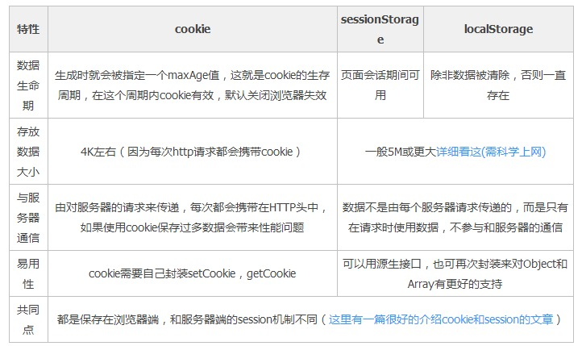

# localstorage、sessionstorage、cookie、session比较

## localStorage与sessionStorage

相同点：两者都属于web storage,允许存储的大小为5M左右，都是用来存储客户端临时信息的对象，信息保存在客户端且存储的值类型均为字符串
区别：两者的生命周期不同。sessionStorage仅仅对当前对话有效，为临时保存，关闭浏览器或结束当前会话其值会被自动清除；localStorage只要你手动不清缓存或者removeItem,clear等操作，设置的值会一直存在，关闭浏览器后还会存在，再次打开同源网站的时候依然能看到，为永久保存。

## web storage与cookie

相同点：两者都是存储在客户端
区别：
1.cookie存储大小受限，只有4kb,web storage有5M左右。  
2.web storage都保存在客户端，不与服务器进行交互通信,节省了网络流量；cookie的作用是与服务器进行交互，作为http规范的一部分而存在，在每次请求一个新的页面的时候cookie都会被发送过去，比较浪费带宽。  

## cookie与session

cookie可以被篡改，会暴露出来一些信息，存在安全性的问题，所以我们启用服务器端session保存，cookie中只保存sessionId；防止session的泄露，可以使用https。  
cookie可以在前后端进行用户的身份认证，标记用户。说到为什么要使用cookie，那得说到http。话说，http是一种无状态的协议，它的无状态可以用翻脸不认人（浏览器）来表示了；以至于服务器不会记得前一秒是哪个客户端向它发出了请求，这就会导致一种情况出现：小熊登录了淘宝；跳转一下页面，需要再登录；加入购物车，需要再登录；付款需要在登陆……想想真是太糟糕，用户体验极差，不能好好玩耍了。  
在服务端的解决办法是：用session去管理cookie。  
session是由cookie进行标记的。当需要记住用户时，比如前面说的登录，在服务端会设置一个响应头Set-Cookie，返回给客户端，例如：Set-Cookie:SESSIONID=12345678；客户端接收到这个响应后，此后发送的每一个请求浏览器都会自动带上Cookie请求头，对应内容是Cookie:SESSIONID=12345678。在服务端内存中存有session，将客户端发送的请求中的cookie值与内存中的session进行对比，就可以识别这个客户端了。
但是这又会引发新的问题。  
如果用session在服务端进行存储，会出现的情况是，在一个处理淘宝业务的服务器集群中，不同的服务器被分配处理的业务不同，他们都处于淘宝这个大域名下，每台服务器的内存中都保留着一份同样的session，这就涉及到服务器之间session的复制。如若有100台服务器，每台服务器都有着同样的session，那么session所占用的内存之多可以想象。服务器既要处理业务，还得维护session的同步，如此一来，服务器无法通过增加业务的方式进行扩张，不易进行横向扩展。
解决办法：将有状态的服务转化为无状态的服务  
（1）共享session  
将session提取出来，集中存放（有点像开辟了一个session数据库的赶脚。。）
（2）token  
服务是不需要进行存储，服务可以通过解析token里面的信息来判断是否登陆。token 里面是可以携带cookie解析出来的信息的。这种情况下，去掉了服务器存储的负担，只需要每次在服务端对token增加一个校验就可以了。

*****

## 概念解释

**同源：**指两个 URL 的协议/主机名/端口一致。例如，https://www.taobao.com/pages/...，它的协议是https，主机名是 www.taobao.com，端口是 443.  
**同站：**只要两个 URL 的 eTLD+1 相同即可，不需要考虑协议和端口,eTLD 表示有效顶级域名，注册于 Mozilla 维护的公共后缀列表（Public Suffix List）中，例如，.com、.co.uk、.github.io 等。eTLD+1 则表示，有效顶级域名+二级域名，例如 taobao.com 等。  
*举例：*www.taobao.com 和 www.baidu.com 是跨站，www.a.taobao.com 和 www.b.taobao.com 是同站，a.github.io 和 b.github.io 是跨站(注意是跨站)。

**sessionStorage：**将数据保存在session对象中。所谓session，是指用户在浏览某个网站时，从进入网站到浏览器关闭所经过的这段时间，也就是用户浏览这个网站所花费的时间。session对象可以用来保存在这段时间内所要求保存的任何数据。

**localStorage：**将数据保存在客户端本地的硬件设备(通常指硬盘，也可以是其他硬件设备)中，即使浏览器被关闭了，该数据仍然存在，下次打开浏览器访问网站时仍然可以继续使用。